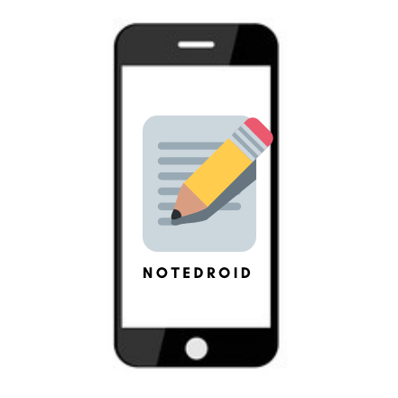

  

### NoteDroid

 A simple android app written in Kotlin to take notes and be productive. This app was built under Android Study Jams 2021 for students to learn and contribute to Android Development  

---

# NoteDroid
An Android App for all your Notes

Reserved repository for Android Study Jams 2021 participants.

## **Problem Statement**

Amidst this COVID times, we all have somewhere been lazy and been lacking on productivity. Taking notes of what you do or what you are going to do is a very effective way of being productive.

## **Solution**

Using <b>MVVM architecture, ViewModel, Room DB, LiveData, Coroutines</b> and many of the <b>Jetpack Libraries</b>, we have built this app that helps you take your notes and also helps you marks notes that are important for you based on your priority.

## **Screenshots**

## **Functionality & Concepts used**

The App has a very simple and interactive design which helps the students to easily take notes and have them prioritised according to their needs.
Following are few android concepts used to achieve the functionalities in app :

- `Constraint Layout` : All of the activities in the app uses a flexible <b>Constraint Layout</b>, which is easy to handle for different screen sizes.
- `Recyclerview` :  To present the list of different notes and important notes we used the efficient <b>Recyclerview</b>. 
- `Room Persistence Library` : To store the Notes that you enter and to make sure your data is not lost after you leave the app, we are using the <b>Room Persistence Library</b> to have them stored in a local database.
- `LiveData` : We are also using <b>LiveData</b> to update & observe any changes notes list and updating it to local databases using Room.
- `Navigation Component` : We are also using the Navigation component to switch pages/destination within the app.

## **Application Link & Future Scope**

The app is currently in the Alpha testing phase within the SNU campus with a limited no. of users. You can access the app by cloning the repo and building it on Android Studio.
Also we welcome, anyone who has an idea or wants to contribute to the project.

### Thank You
